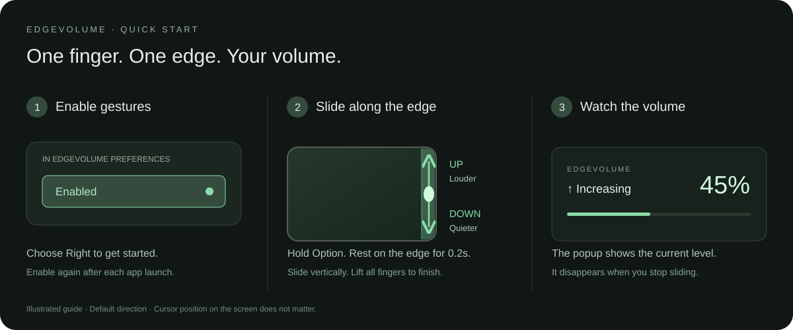
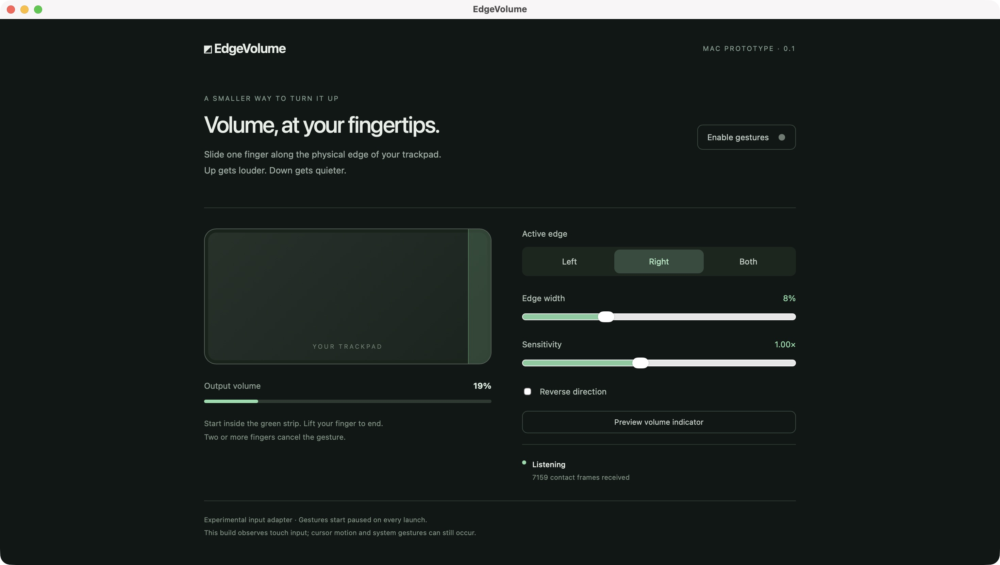

# EdgeVolume

Control your Mac's system volume by sliding one finger along the **physical edge of its trackpad**, wherever the cursor is on screen.

EdgeVolume is an experimental desktop utility built with **Tauri 2, Rust, React, and TypeScript**. A small floating indicator shows the current volume and whether it is increasing or decreasing.

> **Platform status:** The macOS prototype is implemented and has been tested on an Apple Silicon Mac. Windows development has started: source builds include audio controls and read-only touchpad diagnostics. Windows physical edge gestures are not implemented or hardware-validated yet.

## See how it works



**1. Enable gestures.** Open EdgeVolume and click **Enable gestures**. Start with the default **Right** edge.

**2. Slide on the trackpad itself.** Place one finger inside the rightmost strip. Slide up to increase volume or down to decrease it. Your cursor can be anywhere on the screen. Lift your finger when you are done. This guide shows the default direction; **Reverse direction** swaps up and down.

**3. Watch the popup.** It shows the actual volume percentage and whether volume is increasing or decreasing, then disappears after you stop. The guide above is an illustration; the image below is a screenshot of the real Mac app.

### Choose your edge and sensitivity



The green strip marks the active part of the **physical trackpad**. Choose **Left**, **Right**, or **Both**, adjust **Edge width** if the strip feels too narrow, and adjust **Sensitivity** to change how quickly volume moves. The screenshot shows gestures paused; click **Enable gestures** to start.

## For laptop users: the easiest way to use it

### MacBook users — no developer tools needed

1. Open [the Mac downloads](https://github.com/reveuse12/edge-volume/releases/tag/v0.1.0).
2. Check **Apple menu → About This Mac**. For an M-series chip, download `EdgeVolume-v0.1.0-apple-silicon.dmg`. For an Intel processor, download `EdgeVolume-v0.1.0-intel.dmg`.
3. Open the downloaded disk image and drag **EdgeVolume** onto **Applications**.
4. Open EdgeVolume from Applications and click **Enable gestures**.
5. Slide one finger **up or down along the far-right edge of the trackpad**. The floating popup shows your volume percentage.

**Rust, Node.js, npm, Xcode, and Terminal are not needed to use the downloaded app.** Requires macOS 15 or newer. ZIP downloads containing the same app are also available.

This is an **early-access release**: the apps are ad-hoc signed, not Apple Developer ID signed or notarized. macOS may require your approval before the first launch. If you choose to run it, follow [Apple's instructions for an app from an unidentified developer](https://support.apple.com/en-us/102445). Do not disable your Mac's security protections.

#### If macOS blocks the first launch

Only approve the app if you downloaded it from this repository's release page and trust it.

1. Open the **DMG** and drag **EdgeVolume** into **Applications**.
2. Open EdgeVolume from Applications. If macOS blocks it, click **Done**.
3. Open **System Settings → Privacy & Security**.
4. Scroll down and click **Open Anyway** beside the EdgeVolume message.
5. Confirm with your password or Touch ID if prompted, then click **Open**.

This approves that app for future launches. The **Open Anyway** option appears after you have tried opening the blocked app. See [Apple's official instructions](https://support.apple.com/en-us/102445). If the warning says the app is damaged or will harm your computer, stop and check the download rather than treating it as a normal first-launch approval.

You can close the settings window and keep using the gesture. Click the EdgeVolume menu bar icon to open preferences, pause gestures, or quit. After reopening the app, enable gestures again.

Apple Silicon hardware input was tested on macOS 27.0.1. Intel builds are compiled in GitHub Actions; Intel trackpad behavior and other macOS versions still need hands-on validation.

Want to change the code? The developer setup below is separate from installing the downloaded app.

### Windows laptop users

**Windows physical edge gestures are not available yet.** The new development build adds system volume read/write, an indicator preview, explicit ±5 percentage point audio test buttons, and background touchpad HID diagnostics. It does not decode finger coordinates or enable gestures.

See [Windows development setup and hardware checks](docs/windows-development.md) for the experimental installer, read-only probe, and test instructions. Windows builds are produced by the **Windows development build** GitHub Actions workflow; they are development artifacts, not a supported public release. Packaged users do not need Rust or Node.js.

## Features

- Choose the left edge, right edge, or both edges.
- Adjust the active strip width from 3% to 20% of the trackpad surface.
- Set gesture sensitivity and reverse the volume direction.
- See the actual output volume percentage in a floating, click-through indicator.
- Get Increasing, Decreasing, Maximum volume, Muted, or Volume unchanged feedback.
- Preview the indicator without changing volume.
- View live trackpad contact positions and input frame counts in preferences.
- Save edge and sensitivity settings between launches.
- Open preferences, pause gestures, or quit from the menu bar.

## Developer setup on macOS

### Requirements

- Node.js 20 or newer and npm.
- A stable Rust toolchain installed with [rustup](https://rustup.rs/).
- Xcode Command Line Tools. Install them with `xcode-select --install` if needed.
- A supported Apple multitouch trackpad and an output device with adjustable system volume.

Release builds target macOS 15 or newer. Hardware input was validated on **Apple Silicon, macOS 27.0.1**; other hardware and OS versions still need validation. The original PRD's macOS 12+ target is deferred.

### Install and run

```sh
git clone https://github.com/reveuse12/edge-volume.git
cd edge-volume
npm ci
npm run tauri dev
```

This launches the native desktop app and its development frontend. Running `npm run dev` alone opens the preferences frontend without access to native trackpad input or system volume.

### Use the gesture

1. Open preferences and choose an active edge. The default is the rightmost 8% of the trackpad.
2. Click **Enable gestures**. Gestures start paused on each launch while the input adapter is experimental.
3. Place one finger inside the highlighted strip and slide vertically. Up increases volume; down decreases it, unless direction is reversed.
4. Lift your finger to finish. The volume indicator disappears 1.4 seconds after the last adjustment.

A small activation deadzone filters tiny movements. Starting outside the strip, adding another finger, leaving the strip, or a large coordinate jump cancels the gesture until all fingers lift.

**Closing preferences keeps EdgeVolume running in the menu bar.** Choose **Quit EdgeVolume** from its menu to exit.

## Volume indicator

The indicator appears near the lower-right corner of the display associated with its window. On macOS it is configured to join desktop Spaces and other apps' fullscreen Spaces, remain visible when EdgeVolume is inactive, and display above ordinary app windows. It stays above ordinary windows, does not take keyboard focus, and ignores clicks. It reads volume back from the audio device after adjustments, so the percentage reflects the reported output level.

Click **Preview volume indicator** in preferences to show your current volume for five seconds without changing it.

## Build and check

```sh
# TypeScript check and production frontend build
npm run build

# Gesture engine tests
cargo test --locked --manifest-path src-tauri/Cargo.toml

# Package the desktop application
npm run tauri build
```

The macOS app is generated at:

```text
src-tauri/target/release/bundle/macos/EdgeVolume.app
```

For a development bundle, run `npm run tauri build -- --debug`. Its app is under `src-tauri/target/debug/bundle/macos/`. Builds use an ad-hoc signature. Developer ID signing and Apple notarization are not configured.

### Read-only hardware probe

To check native trackpad input and audio access independently of the UI:

```sh
clang tools/mac-probe.c src-tauri/native/mac.c \
  -framework CoreFoundation -framework CoreAudio \
  -o /tmp/edgevolume-probe
/tmp/edgevolume-probe
```

Touch the trackpad during the five-second probe. It reports adapter startup, the audio read status, and aggregate frame counts. It does not change volume.

## How it works

```text
Physical trackpad contacts
    → macOS native input adapter
    → Rust edge gesture state machine
    → CoreAudio default output volume
    → React preferences and floating indicator
```

The macOS adapter dynamically loads Apple's private `MultitouchSupport` framework to receive normalized finger coordinates. Ordinary cursor or scroll events cannot identify the physical trackpad edge.

The Rust engine requires a single contact that begins inside an active edge, applies an activation deadzone, rejects invalid gestures, and clamps volume to 0–100%. CoreAudio reads and writes the current default output device. Unsupported audio outputs pause gestures and report an error.

Settings are stored in Tauri's application configuration directory as `settings.json`. Trackpad contact data is held in memory; the app does not send it over the network or write it to logs.

## Project structure

| Path | Purpose |
| --- | --- |
| `src/main.tsx` | Preferences and volume indicator UI |
| `src/style.css` | UI styling |
| `src-tauri/src/gesture.rs` | Gesture recognition and tests |
| `src-tauri/src/main.rs` | Desktop lifecycle, settings, commands, tray, and indicator |
| `src-tauri/native/mac.c` | macOS physical contact and CoreAudio adapters |
| `src-tauri/native/windows.cpp` | Windows endpoint audio and background HID diagnostics |
| `src-tauri/native/overlay.m` | macOS cross-app and fullscreen overlay behavior |
| `tools/windows-probe.cpp` | Read-only Windows hardware diagnostic |
| `tools/mac-probe.c` | Read-only hardware diagnostic |
| `PRD_ Cross-Platform Trackpad Edge Volume Control.md` | Requirements and implementation clarifications |

## Current limitations

- **Private macOS API:** OS updates can break the undocumented input ABI. Mac App Store compatibility is not claimed.
- **System gestures remain active:** The prototype observes touches; it does not suppress cursor motion or native trackpad gestures during volume adjustment.
- **One trackpad per session:** The adapter selects a trackpad at startup. Restart after connecting or reconnecting devices.
- **Windows is pending:** Windows audio and background HID diagnostics are implemented for development. Contact decoding and physical edge gestures remain pending hardware validation.
- **Release features are pending:** No launch at login, fullscreen/app exclusions, mute shortcut, or updater.
- **Performance targets remain unverified:** Memory, latency, installer size, older macOS versions, and Intel compatibility still need measurement and hardware testing.
- **Fullscreen behavior is unverified:** Cross-app and fullscreen window behavior is configured explicitly on macOS; coverage across fullscreen apps, Spaces, and multiple monitors still needs hands-on testing.

The observation-only input adapter does not currently request Accessibility or Input Monitoring permission. A future input suppression adapter will need its own permission handling and validation.

## Validation to date

On 7 October 2026:

- Production frontend build and TypeScript checks passed.
- Five Rust gesture tests passed.
- The debug macOS app bundled and opened successfully.
- The hardware probe received real trackpad contacts and read system volume.
- Desktop preferences displayed live input and output volume.
- The floating indicator was visually verified using the read-only preview.

These checks establish a working Mac prototype, not cross-platform release readiness.

## Next milestones

- Validate edge gestures, accidental activation, sleep/wake, reconnects, and audio device changes on more Macs.
- Add permission-gated suppression of pointer and scroll events during active volume gestures.
- Implement and validate Windows Precision Touchpad and audio adapters.
- Add launch at login, exclusions, and optional mute controls.
- Profile resource usage and prepare signed release packages.

## Technical references

- [macOSMiddleClick: private multitouch ABI reference](https://github.com/SomeGuyNamedDaveIsTaken/macOSMiddleClick)
- [Microsoft: Windows Precision Touchpad collection](https://learn.microsoft.com/en-us/windows-hardware/design/component-guidelines/touchpad-windows-precision-touchpad-collection)

## Publishing Mac downloads

The `.github/workflows/release.yml` workflow builds and tests separate Apple Silicon and Intel apps when a version tag is pushed. It verifies each app's signature and architecture, packages a DMG and ZIP, creates SHA-256 checksums, and publishes a GitHub prerelease only after both builds succeed.

To publish a new version, update the version in `package.json`, `src-tauri/Cargo.toml`, and `src-tauri/tauri.conf.json`, regenerate the lockfiles, update release notes and download links, then push the matching `vX.Y.Z` tag. No release signing secrets are required for the current ad-hoc builds. A smoother first-launch experience requires Apple Developer ID signing and notarization in a later release.

## Duplicate app entries during local development

macOS app search can show more than one EdgeVolume entry when it finds multiple `.app` bundles. Developers may have a debug app, a release app, and a packaging test copy in `src-tauri/target/`, alongside the installed copy in `/Applications`.

These are separate files, not evidence that multiple app processes are running. For everyday use, open **Finder → Applications → EdgeVolume**. Build and test copies are not required by the installed app and can be moved to Trash when you no longer need them. Installing from the DMG alone does not create the debug or packaging test copies.
